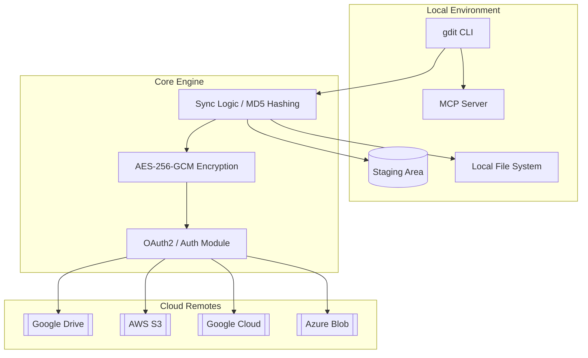

# gdit

<p align="center">
  <a href="https://www.npmjs.com/package/gdit"></a>
  <a href="https://www.npmjs.com/package/gdit"></a>
  <a href="https://github.com/praaatap/Gdit/blob/main/LICENSE"></a>
  <a href="https://github.com/praaatap/Gdit/stargazers"></a>
</p>

<p align="center">
  <b>Git-like version control for Google Drive</b><br>
  <i>Stage, commit, and sync your files with ease across multiple clouds.</i>
</p>

---

## 🌟 Overview

**gdit** (Google Drive Git) is a powerful, high-performance CLI tool that brings a familiar Git-like workflow to your Google Drive and other cloud storage providers. Built with **TypeScript** and designed for the modern developer, it bridges the gap between local development and cloud-based file management.

> [!IMPORTANT]
> **gdit** now features full **Model Context Protocol (MCP)** integration, allowing AI agents like Cursor or Claude to manage your cloud storage and repository state autonomously.

---

## ✨ Features

### 🛠️ Core Git Workflow
- **`init` & `clone`**: Quickly setup or sync existing Drive folders.
- **`add` & `rm`**: Intuitive staging area management.
- **`commit`**: Version your changes locally before syncing.
- **`push` & `pull`**: Bi-directional synchronization with MD5-based smart updates.

### 🛡️ Enterprise-Grade Security
- **Client-Side Encryption**: AES-256-GCM encryption secures your data *before* it leaves your machine.
- **Zero-Storage**: Your OAuth tokens and encryption keys stay strictly on your local machine.
- **Security Purge**: Instantly wipe all local sensitive data with `gdit security purge`.

### ☁️ Universal Cloud Engine
Native integration for the industry leaders:
- 📦 **Google Drive**: The primary versioning remote.
- 🪣 **AWS S3**: List, sync, and manage buckets.
- ☁️ **Google Cloud Storage**: Full GCS operations support.
- 💠 **Azure Blob Storage**: Enterprise blob management.

### 🔌 AI-Ready (New!)
- **MCP Server**: Built-in support for the Model Context Protocol.
- **AI Tools**: LLMs can now use `gdit status`, `gdit log`, and more.
- **Cloud Resources**: Expose your repo config directly to AI agents.

---

## 🏗️ Architecture



---

## 🚀 Quick Start

### 1. Installation
```bash
npm install -g gdit
```

### 2. Authentication
```bash
gdit setup-creds   # Configure your Google API credentials
gdit login         # Authenticate with your account
```

### 3. Initialize & Sync
```bash
gdit init                          # Create a new remote repo
gdit add .                         # Stage your work
gdit commit -m "feat: Initial sync" # Create a local snapshot
gdit push                          # Securely upload to Drive
```

---

## 🔌 AI Integration (MCP)

`gdit` is fully compatible with any MCP client (like **Claude Desktop** or **Cursor**).

### Configuration

Add this to your MCP configuration file:

```json
{
  "mcpServers": {
    "gdit": {
      "command": "gdit",
      "args": ["mcp"]
    }
  }
}
```

### Dynamic AI Tools
Once connected, your AI assistant can use tools like:
- `gdit_status`: Understand current local changes.
- `gdit_push`: Request the AI to sync your work cloud-side.
- `gdit_whoami`: Let the AI check your storage usage.

---

## 📜 Command Reference

| Command | Action | Provider |
| :--- | :--- | :--- |
| `gdit init` | Setup a new repository | Google Drive |
| `gdit push` | Upload local changes | Google Drive |
| `gdit s3 list` | List bucket contents | AWS S3 |
| `gdit gcp sync` | Sync with cloud bucket | GCS |
| `gdit azure list`| Manage blob containers | Azure |
| `gdit mcp` | Launch the MCP server | Universal |

> For a full list of commands, run `gdit --help`.

---

## 🤝 Contributing & Support

We love community involvement! Whether it's a bug report or a feature request, feel free to open an issue or submit a pull request.

- 🐛 [Report a Bug](https://github.com/praaatap/Gdit/issues)
- ✨ [Request a Feature](https://github.com/praaatap/Gdit/issues)
- 📝 [Read the Guide](CONTRIBUTING.md)

## 🤖 MCP Server Integration

`gdit` now includes a built-in **Model Context Protocol (MCP)** server, allowing AI agents (like Claude Desktop or Cursor) to interact directly with your repository.

### Configuration

Add the following to your MCP server configuration:

```json
{
  "mcpServers": {
    "gdit": {
      "command": "node",
      "args": ["/path/to/gdit/dist/index.js", "mcp"]
    }
  }
}
```

### Key Tools
- `gdit_status`: Check repo state.
- `gdit_push`/`gdit_pull`: Sync with Google Drive.
- `gdit_list_remote`: Browse remote files in Drive.
- `gdit_whoami`: Check storage quota.

## License
<p align="center">
  Released under the MIT License. Copyright © 2024-2026 gdit Contributors.
</p>
